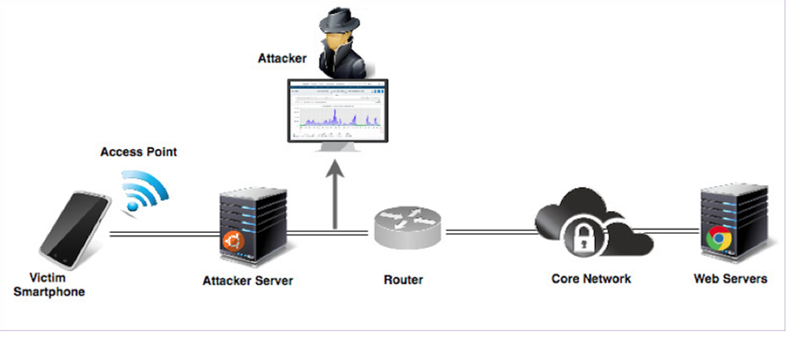

# Cyber Attacks Detection


Descripción del procesamiento final posterior a las etapas de ETL y análisis exploratorio.

**Autor: Jorge Aguirre**

### Archivos:
- [Notebook 1](Notebook01.ipynb): Proceso ETL del DataSet, análisis exploratorio e hipótesis.
- [Notebook 2](Notebook02.ipynb): Exploración adicional del dataframe previo al trabajo de ML propiamente dicho.
- [Notebook 3](Notebook03.ipynb): Procesamiento final mediante modelos de clasificación.

## Introducción:

_En el contexto de la ciberseguridad, donde la proliferación de ciberataques es cada vez más común, surge la necesidad de proteger estas redes contra éstas amenazas. Este proyecto de Data Science busca analizar conjuntos de datos de tráfico IoT e IIoT._

## Objetivo:

**Mi objetivo principal es desarrollar un modelo de detección de intrusiones capaz de identificar y bloquear automáticamente actividades maliciosas en tiempo real. Al integrar este modelo en dispositivos de seguridad de borde, como firewalls, se espera mejorar la eficiencia de los sistemas de seguridad y proteger mejor las redes contra ataques cibernéticos. Todo gracias a ésta detección que nos proveerá el modelo.**

## Hipótesis:
+ Como disponemos de la información del protocolo de cada paquete, esperamos que los protocolos más atacados sean TCP y UDP por ser los más populares.
+ En base al siguiente artículo esperamos encontrar a DoS como el tipo de ataque que más se nos presente en el dataset:
> **10 Most Common Types of Cyber Attacks Today** [Link](https://www.crowdstrike.com/cybersecurity-101/cyberattacks/most-common-types-of-cyberattacks/)
+ Respecto a las pérdidas de paquetes y retransmisiones esperamos que aumenten debido a la distorsión introducida por los ataques.



### Instalar dependencias:
Es necesario instalar algunas librerías para poder ejecutar éste notebook aparte de las clásicas como pandas.

```python
# Requisitos por gestor de paquetes
# Crear entorno con conda
conda env create -f environment.yml

# Activar entorno
conda activate cyber-attacks-detection

```

### Diccionario del Dataframe final
Luego extraeremos una cantidad limitada de filas para nuestro trabajo.
| No. | Name            | Type    | Description                                                                                                             |
|-----|-----------------|---------|-------------------------------------------------------------------------------------------------------------------------|
| 1   | srcip           | nominal | Source IP address                                                                                                       |
| 2   | sport           | integer | Source port number                                                                                                      |
| 3   | dstip           | nominal | Destination IP address                                                                                                  |
| 4   | dsport          | integer | Destination port number                                                                                                 |
| 5   | proto           | nominal | Transaction protocol                                                                                                    |
| 6   | state           | nominal | Indicates to the state and its dependent protocol, e.g. ACC, CLO, CON, ECO, ECR, FIN, INT, MAS, PAR, REQ, RST, TST, TXD, URH, URN, and (-) (if not used state) |
| 7   | dur             | Float   | Record total duration                                                                                                   |
| 8   | sbytes          | Integer | Source to destination transaction bytes                                                                                 |
| 9   | dbytes          | Integer | Destination to source transaction bytes                                                                                 |
| 10  | sttl            | Integer | Source to destination time to live value                                                                                |
| 11  | dttl            | Integer | Destination to source time to live value                                                                                |
| 12  | sloss           | Integer | Source packets retransmitted or dropped                                                                                 |
| 13  | dloss           | Integer | Destination packets retransmitted or dropped                                                                            |
| 14  | service         | nominal | http, ftp, smtp, ssh, dns, ftp-data ,irc  and (-) if not much used service                                               |
| 15  | Sload           | Float   | Source bits per second                                                                                                  |
| 16  | Dload           | Float   | Destination bits per second                                                                                             |
| 17  | Spkts           | integer | Source to destination packet count                                                                                      |
| 18  | Dpkts           | integer | Destination to source packet count                                                                                      |
| 19  | swin            | integer | Source TCP window advertisement value                                                                                   |
| 20  | dwin            | integer | Destination TCP window advertisement value                                                                              |
| 21  | stcpb           | integer | Source TCP base sequence number                                                                                         |
| 22  | dtcpb           | integer | Destination TCP base sequence number                                                                                    |
| 23  | smeansz         | integer | Mean of the flow packet size transmitted by the src                                                                     |
| 24  | dmeansz         | integer | Mean of the flow packet size transmitted by the dst                                                                     |
| 25  | trans_depth     | integer | Represents the pipelined depth into the connection of http request/response transaction                                 |
| 26  | res_bdy_len     | integer | Actual uncompressed content size of the data transferred from the server’s http service                                |
| 27  | Sjit            | Float   | Source jitter (mSec)                                                                                                    |
| 28  | Djit            | Float   | Destination jitter (mSec)                                                                                               |
| 29  | Stime           | Timestamp | record start time                                                                                                      |
| 30  | Ltime           | Timestamp | record last time                                                                                                       |
| 31  | Sintpkt         | Float   | Source interpacket arrival time (mSec)                                                                                  |
| 32  | Dintpkt         | Float   | Destination interpacket arrival time (mSec)                                                                             |
| 33  | tcprtt          | Float   | TCP connection setup round-trip time, the sum of ’synack’ and ’ackdat’.                                                |
| 34  | synack          | Float   | TCP connection setup time, the time between the SYN and the SYN_ACK packets.                                            |
| 35  | ackdat          | Float   | TCP connection setup time, the time between the SYN_ACK and the ACK packets.                                            |
| 36  | is_sm_ips_ports | Binary  | If source (1) and destination (3)IP addresses equal and port numbers (2)(4) equal then, this variable takes value 1 else 0 |
| 37  | ct_state_ttl    | Integer | No. for each state (6) according to specific range of values for source/destination time to live (10) (11).            |
| 38  | ct_flw_http_mthd | Integer | No. of flows that has methods such as Get and Post in http service.                                                     |
| 39  | is_ftp_login    | Binary  | If the ftp session is accessed by user and password then 1 else 0.                                                      |
| 40  | ct_ftp_cmd      | integer | No of flows that has a command in ftp session.                                                                          |
| 41  | ct_srv_src      | integer | No. of connections that contain the same service (14) and source address (1) in 100 connections according to the last time (26). |
| 42  | ct_srv_dst      | integer | No. of connections that contain the same service (14) and destination address (3) in 100 connections according to the last time (26). |
| 43  | ct_dst_ltm      | integer | No. of connections of the same destination address (3) in 100 connections according to the last time (26).            |
| 44  | ct_src_ltm      | integer | No. of connections of the same source address (1) in 100 connections according to the last time (26).                 |
| 45  | ct_src_dport_ltm | integer | No of connections of the same source address (1) and the destination port (4) in 100 connections according to the last time (26). |
| 46  | ct_dst_sport_ltm | integer | No of connections of the same destination address (3) and the source port (2) in 100 connections according to the last time (26). |
| 47  | ct_dst_src_ltm  | integer | No of connections of the same source (1) and the destination (3) address in in 100 connections according to the last time (26). |
| 48  | attack_cat      | nominal | The name of each attack category. In this data set, nine categories e.g. Fuzzers, Analysis, Backdoors, DoS Exploits, Generic, Reconnaissance, Shellcode and Worms |
| 49  | Label           | binary  | 0 for normal and 1 for attack records                                                                                    |

## 📄 License

This project is licensed under the [MIT License](./LICENSE).

💡 For commercial inquiries or specific licensing questions, feel free to contact me.